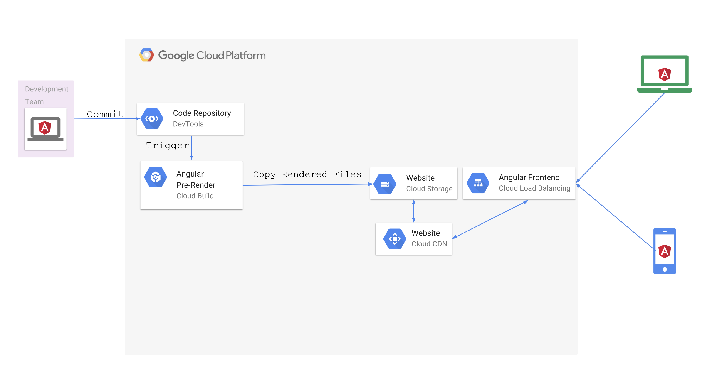

# Perform Angular Serverside (Pre-)Rendering via Cloud Build
This tutorial will show you how to pre-generate [server-side rendered Angular pages](https://angular.io/guide/universal) using Cloud Build. Server-side rendering helps facilitate web crawlers (SEO), improve performance on mobile and low-powered devices
 and show the first page quickly




## Prerequisites

1.  A Google Cloud account
1.  At least project editor access to an existing project
1.  Or organization permissions to create a new project in an existing
    organization [get a trial account here](https://console.cloud.google.com/freetrial?authuser=2&_ga=2.213928212.-2042919442.1528299768&_gac=1.89261801.1536929612.CjwKCAjwuO3cBRAyEiwAzOxKslw2lWJAN82nAhsu1azihQgX_7aQjek2MPEjanoAwKL5g70Rp0b9zRoCgFwQAvD_BwE)

## (OPTIONAL) Create a project with a billing account attached

This task will help you setup a new GCP project in which to run your packer
build factory. **(you can also use an existing project and skip to the next
step)**

    PROJECT=[NEW PROJECT NAME]
    ORG=[YOUR ORGANIZATION NAME]
    FOLDER=[YOUR FOLDER NAME]
    BILLING_ACCOUNT=[YOUR_BILLING_ACCOUNT_NAME]
    ZONE=[COMPUTE ZONE YOU WANT TO USE]
    ACCOUNT=[GOOGLE ACCOUNT YOU WANT TO USE] or $(gcloud config get-value account)
    ORG_NUMBER=$(gcloud organizations list --format="value(name)" --filter="(displayName='$ORG')")
    FOLDER_NUMBER=$(gcloud alpha resource-manager folders list --format="value(name)" --organization=$ORG_NUMBER --filter="displayName=$FOLDER")
    PROJECT_CREATE_OPTIONS="--organization=${ORG_NUMBER}"
    if [ ! -z "$FOLDER" ]; then
        PROJECT_CREATE_OPTIONS="--folder=${FOLDER_NUMBER}"
    fi
    gcloud projects create ${PROJECT} ${PROJECT_CREATE_OPTIONS}
    gcloud beta billing projects link $PROJECT --billing-account=$(gcloud alpha billing accounts list --format='value(name)' --filter="(displayName='$BILLING_ACCOUNT')")
    gcloud config configurations create --activate $PROJECT
    gcloud config set project $PROJECT
    gcloud config set compute/zone $ZONE
    gcloud config set account $ACCOUNT

### Set the project variable (Skip this step if you created a new project above)

Ensure you are working with the project you want to use in gcloud.
For more information on configuraitons see [configurations](https://cloud.google.com/sdk/gcloud/reference/config/configurations/).
Fill in `[CONFIGURATION NAME]` with the name of the configuration you want to use.

    gcloud config configurations activate [CONFIGURATION NAME] #The configuration for the project you want to use
    PROJECT=$(gcloud config get-value project)

### Enable the services required for the tutorial

    gcloud services enable sourcerepo.googleapis.com
    gcloud services enable containerregistry.googleapis.com

## Download the Test Angular Application, Tour of Heros

1. Download and unzip the test application
```
curl -L https://angular.io/generated/zips/universal/universal.zip > universal.zip
unzip universal.zip -d angular-app
cd angular-app
```

1. Create a local git repo for the sample code
```
curl -L https://github.com/angular/angular/blob/master/.gitignore > .gitignore
git init
git add .
git commit -m "first"
```

### Create a Cloud Source Repository for your copy of the test Angular Application

    gcloud source repos create tour-of-heros-universal

### Make prerender changes to the angular application

1. Download the webpack prerender config file.
```
curl -L https://raw.githubusercontent.com/GoogleCloudPlatform/community/master/tutorials/cloudbuild-angular-universal/webpack.prerender.config.js > webpack.prerender.config.js
```
2. Add the prerender webpack configuration file to git.
```
     git add webpack.prerender.config.js
```
3. Download the typescript config file for prerendering.
```
curl -L https://raw.githubusercontent.com/GoogleCloudPlatform/community/master/tutorials/cloudbuild-angular-universal/prerender.tsconfig.json >prerender.tsconfig.json
```
4. Add the prerender typscript file to git.
```
git add prerender.tsconfig.json
```
5. Download the prerender typescript file.
```
curl -L https://raw.githubusercontent.com/GoogleCloudPlatform/community/master/tutorials/cloudbuild-angular-universal/prerender.ts >prerender.ts
```
6. Edit the package.json file to add the prerender steps.
```
read -r -d '' SCRIPT_ADDITIONS <<EOF
{
"build:prerender": "npm run build:client-and-server-bundles && npm run compile:prerender && npm run generate:prerender",
"generate:prerender": "npm run webpack:prerender && node dist/prerender.js",
"compile:prerender": "tsc -p prerender.tsconfig.json",
"webpack:prerender": "webpack --config webpack.prerender.config.js"
}
EOF
cat package.json | jq --argjson additions "$SCRIPT_ADDITIONS" '.scripts = .scripts+$additions' >tmpfile
cp tmpfile package.json
rm tmpfile
```
**Note** that jq is a tool for editing JSON and is installed in Cloudshell by default. If you are going through this tutorial on your workstation see [jq installation](https://stedolan.github.io/jq/download/) for instructions on installing jq on your workstation.

6. Add the package.json changes to git.
```
git add package.json
```
4. Commit your changes to the git repo
```
git commit -m "pregenerate changes"
```
### Configure a Cloud Storage Bucket and Cloud Load Balancer to host your Angular Application on Cloud CDN

1. Create the content cloud storage bucket.
```
gsutil mb gs://$PROJECT-angular-app
```
2. Create the backend-bucket.
```
gcloud compute backend-buckets create $PROJECT-angular-app-backend \
--gcs-bucket-name=$PROJECT-angular-app \
--enable-cdn
```
3. Create a multi-regional ip address.
```
gcloud compute addresses create angular-app-ip --global
ANGULAR_APP_IP=$(gcloud compute addresses list  --filter="name=angular-app-ip" --format="value(address)")
```
3. Create the url map.
```
gcloud compute url-maps create web-map --default-backend-bucket $PROJECT-angular-app-backend
```
4. Create the http proxy.
```
gcloud compute target-http-proxies create http-lb-proxy \
--url-map web-map
```
5. Create the forwarding rule.
```
gcloud compute forwarding-rules create http-content-rule \
--address angular-app-ip \
--global \
--target-http-proxy http-lb-proxy \
--ports 80
```
## Create the Cloudbuild file and add it to the git repsoitory
1. Give the cloudbuild cloud storage admin access.
```
CLOUD_BUILD_ACCOUNT=$(gcloud projects get-iam-policy $PROJECT --filter="(bindings.role:roles/cloudbuild)"  --flatten="bindings[].members" --format="value(bindings.members[])")
cloud projects add-iam-policy-binding $PROJECT   --member $CLOUD_BUILD_ACCOUNT  --role role
s/storage.admin
```
2. Create the ```cloudbuild.yaml``` file.
```
cat <<CLOUDBUILD_FILE>cloudbuild.yaml
steps:
- id: install_packages
  name: 'gcr.io/cloud-builders/npm'
  args:
  - 'install'
- id: prerender_browser_files
  name: 'gcr.io/cloud-builders/npm'
  args:
  - 'run'
  - 'build:prerender'
  waitFor:
  - install_packages
- id: copy_prerendered_files
  name: 'gcr.io/cloud-builders/gsutil'
  args: ['cp','-r','dist/browser/*', '\${_ANGULAR_APP_BUCKET_PATH}']
  waitFor:
  - prerender_browser_files
- id: set_website_configuration
  name: 'gcr.io/cloud-builders/gsutil'
  args: ['web', 'set', '-m', 'index.html','\${_ANGULAR_APP_BUCKET_PATH}']
  waitFor:
  - copy_prerendered_files
- id: set_permissions_for_website_files
  name: 'gcr.io/cloud-builders/gsutil'
  args: ['acl','ch','-u','AllUsers:R','-r', '\${_ANGULAR_APP_BUCKET_PATH}']
  waitFor:
  - copy_prerendered_files
CLOUDBUILD_FILE
```

3. Add and commit ```cloudbuild.yaml``` to the git repository.
```
git add cloudbuild.yaml && git commit -m "add cloudbuild.yaml"
```
### Create a Build Trigger that will build, test and deploy your application to the Cloud CDN
You can create a trigger on the [build triggers page](https://console.cloud.google.com/cloud-build/triggers) of the GCP Console by following these steps:

1. Click **"Create Trigger"**
1. Select "Cloud Source Repository" Click "Continue".
1. Select "tour-of-heroes-universal" and click "Continue"
1. Enter "angular-universal-tour" for Name."
1. Set the trigger for "Tag".
1. Set the build type to "cloudbuild.yaml"
1. Add a substitution for _ANGULAR_APP_BUCKET_PATH set to gs://[PROJECT]-angular-app where [PROJECT] is the name of your project
1. Click "Create Trigger"


### Add your tour-of-heros cloud source repository as a remote repository with the name 'google'

1.  (Only if not running in Cloud Shell) Set up your google credentials for git.
```
gcloud init && git config --global credential.https://source.developers.google.com.helper gcloud.sh
```

2.  Add the google cloud repo as a remote.
```
git remote add google \
https://source.developers.google.com/p/$PROJECT/r/tour-of-heros-universal
```

## Run the Build Trigger and Deploy the Application

1.  Tag the repository.
```
git tag v0.0
```

2.  Push the repository to google.
```
git push google master && git push google --tags
```

### Once the build and deploy finishes check that the website is deployed
1.  Open up the [Cloud Build](https://console.cloud.google.com/cloud-build) console to show the build progress.
2.  Find the build that is in progress and click the link to view its progress.
3.  Once the build finishes, find the IP address of the load balancer you created above:

```
gcloud compute addresses list  --filter="name=angular-app-ip" --format="value(address)"
```

4. Point your browser at "http://[ANGULAR_APP_IP]", replacing [ANGULAR_APP_IP] with the IP address retrieved above.

### Cleanup
1. Delete the load balancer.

```
gcloud compute forwarding-rules delete http-content-rule --global --quiet

gcloud compute target-http-proxies delete http-lb-proxy --quiet

gcloud compute url-maps delete web-map  --quiet

gcloud compute addresses delete angular-app-ip --global --quiet
```

2. Delete the cloud storage bucket.
```
gcloud compute backend-buckets delete $PROJECT-angular-app-backend --quiet

gsutil rb gs://$PROJECT-angular-app
```
3. Delete the Cloud Source Repository.
```
gcloud source repos delete tour-of-heros-universal --quiet
```

